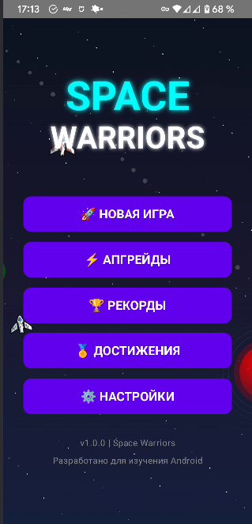
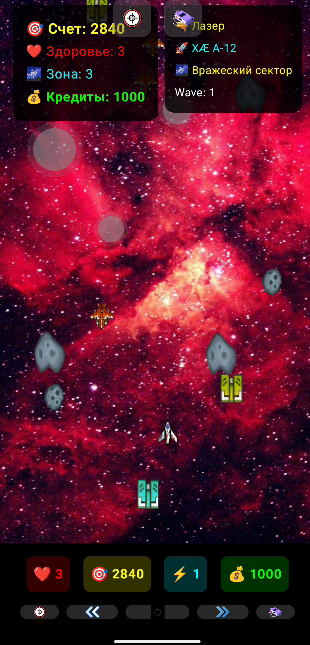
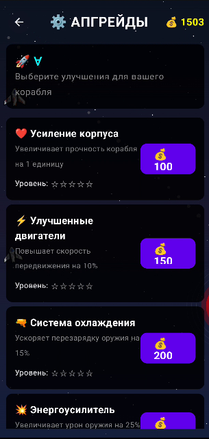
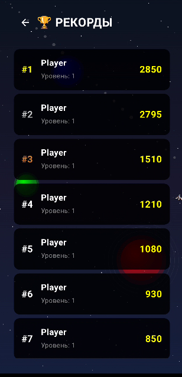
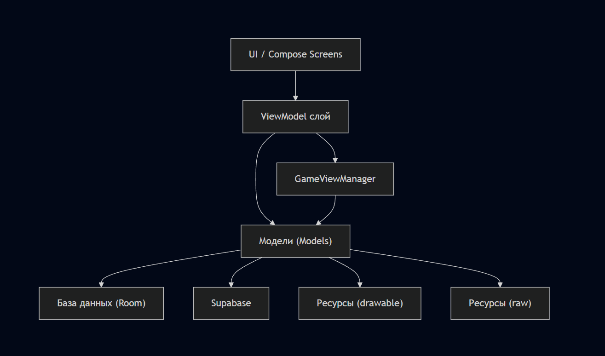

# 🚀 SpaceGame

Современная космическая аркада для Android с уровнями, врагами, бонусами и таблицей рекордов. Проект разработан для учебных целей — чтобы студент мог легко реализовать, защитить и при этом продемонстрировать современные подходы к UI/UX и архитектуре.

---

## 📱 Описание

**SpaceGame** — это минималистичная, но атмосферная аркада, где игрок управляет космическим кораблём, сражается с астероидами и вражескими кораблями, собирает бонусы и проходит уникальные уровни. В игре реализованы таблица рекордов, система бонусов и простое, интуитивное управление.

---

## 🖼️ Скриншоты

| Главное меню | Игровой процесс | Экран апгрейдов | Таблица рекордов |
|--------------|-----------------|-----------------|------------------|
|  |  |  |  |

> _Заглушки: замените на свои скриншоты_

---

## 🌌 Структура игры

- **Главное меню:** Играть, Рекорды, Настройки (музыка, звуки, имя игрока)
- **Игровой процесс:** 3+ уровня, каждый со своими врагами и бонусами
- **Экран завершения:** Итоги, бонусы, переход к следующему уровню или таблице рекордов
- **Таблица рекордов:** Топ-10 игроков (локально и через Supabase)

---

## 🪐 Описание уровней

| Уровень | Окружение         | Враги и бонусы                                   | Цель         |
|---------|-------------------|--------------------------------------------------|--------------|
| 1       | Пустошь           | Простые астероиды                                | 100 очков    |
| 2       | Пояс астероидов   | Астероиды разных размеров, бонусы (щит, ускорение)| 200 очков    |
| 3       | Вторжение         | Астероиды, вражеские корабли, новые бонусы       | 300 очков    |

---

## 👾 Враги

- **Простые астероиды:** летят прямо, 10 очков
- **Крупные астероиды:** летят по дуге, разбиваются на мелкие, 30 очков
- **Вражеские корабли:** сложная траектория, стреляют, 50 очков

---

## 🔫 Оружие

- **Лазер:** стандартное, быстрый выстрел, урон 1
- **Плазменная пушка:** бонусное, очень быстро, урон 2, действует 10 секунд
- **Дробовик (SPREAD_SHOT):** веерный выстрел (3 пули), доступен как временный бонус
- **Рейлган, ракеты, молния, заморозка, ядерка:** уникальные типы оружия с разными эффектами
- **Апгрейды оружия:** влияют на урон, скорострельность, спецэффекты, но не сбрасываются бонусами

---

## 🎁 Бонусы

- **Щит:** защита от одного удара (можно комбинировать с другими бонусами)
- **Ускорение:** временное увеличение скорости (может работать одновременно с другими бонусами)
- **Второе оружие:** временно меняет тип оружия игрока на дробовик (SPREAD_SHOT) на 10 секунд, после чего возвращает исходный тип
- **Неуязвимость:** 5 секунд полной защиты

> Теперь все бонусы могут работать одновременно и не сбрасывают друг друга!

---

## 🛠 Технологии

- **Kotlin, Jetpack Compose** — современный UI и анимации
- **Room** — локальная база данных для рекордов
- **Supabase** — облачная таблица рекордов
- **MVVM + Clean Architecture** — чистый и тестируемый код
- **Canvas** — отрисовка игрового мира
- **Compose Animation** — плавные переходы и эффекты

---

## 🧩 Архитектура и структура проекта

### Модели (`models/`)

- **Ship, ShipType** — описание типов кораблей (истребитель, танк, снайпер, ганшип, стелс), их характеристик, способностей и стоимости. Каждый корабль уникален по стилю игры.
- **Weapon, WeaponType, WeaponUpgrade** — система оружия: лазер, плазма, рейлган, ракеты, дробовик, молния, заморозка, ядерка. Оружие может иметь апгрейды (веерный выстрел, автонаведение, быстрая стрельба и др.).
- **Enemy, Boss** — враги и боссы с разными типами поведения, здоровьем и наградой за уничтожение.
- **Bonus, Upgrade** — бонусы (щит, ускорение, неуязвимость, апгрейды оружия) и система улучшений корабля (здоровье, скорость, урон, скорострельность).
- **PlayerState, GameState, GameSettings** — состояние игрока, всей игры, настройки (уровень сложности, звук, музыка, вибрация).
- **Particle, ParticleSystem, Explosion** — визуальные эффекты: частицы, взрывы, спецэффекты.
- **Achievement** — система достижений для повышения вовлечённости игрока.
- **Zone** — описание игровых зон/уровней, их особенностей и сложности.

### Экраны (`screens/`)

- **MenuScreen** — главное меню с анимированным фоном, кнопками перехода к игре, апгрейдам, рекордам, достижениям и настройкам.
- **GameScreen** — основной игровой процесс: управление кораблём, стрельба, сбор бонусов, отображение HUD, анимации, поддержка автоогня.
- **ResultScreen** — экран завершения уровня/игры с итогами, кнопками "играть снова" и "главное меню".
- **LeaderboardScreen** — таблица рекордов (локально и через Supabase).
- **SettingsScreen** — настройки игры: звук, музыка, вибрация, сложность, информация об игре.
- **UpgradeScreen** — система улучшений корабля (здоровье, скорость, урон, скорострельность), покупка за кредиты.
- **AchievementsScreen** — список достижений и их прогресс.
- **ShipSelectScreen, WeaponSelectScreen** — выбор и покупка кораблей и оружия, отображение характеристик и цен.
- **SplashScreen** — заставка при запуске.

### ViewModel (`viewmodels/`)

- **GameViewModel** — управление логикой игрового процесса: движение, стрельба, столкновения, начисление очков, применение бонусов, переход между уровнями, работа с состоянием игры.
- **GameViewManager** — глобальный менеджер состояния: выбранный корабль, оружие, кредиты, апгрейды, настройки, достижения, управление покупками и разблокировками.
- **LeaderboardViewModel** — загрузка и отображение топ-результатов из локальной базы и Supabase.

---

## ⚙️ Минимальные требования

- Android SDK API Level 29+
- Kotlin 2.1.21+
- JDK 11+
- Android 10 и выше

---

## 🚀 Быстрый старт

1. Клонируйте репозиторий:
   ```bash
   git clone https://github.com/fevfev/SpaceGame.git
   ```
2. Откройте проект в Android Studio.
3. Соберите и запустите на эмуляторе или устройстве.

---

## 📂 Пример структуры проекта

```
src/
  main/
    java/
      com.yourgame/
        screens/
        models/
        database/
        supabase/
        viewmodels/
    res/
      drawable/
      raw/
```

---

## 🎮 Геймплей

- Управляйте кораблём (стрелки или свайпы)
- Стреляйте по врагам (тап или автоатака)
- Собирайте бонусы — теперь можно комбинировать эффекты!
- Проходите уровни, набирайте очки, попадайте в таблицу рекордов

---

## 🎨 UI/UX

- Минималистичный космический стиль, плавные анимации, интуитивный интерфейс
- Микроанимации, адаптивность, доступность
- Поддержка одновременных бонусов и визуальных эффектов

---

## 📦 Примеры кода

### Модель корабля

```kotlin
enum class ShipType { FIGHTER, TANK, SNIPER, GUNSHIP, STEALTH }

data class Ship(
    val type: ShipType,
    val name: String,
    val maxHealth: Int,
    val speed: Float,
    val fireRate: Float,
    val specialAbility: String,
    val imageName: String,
    val price: Int
)
```

### Модель оружия

```kotlin
enum class WeaponType { LASER, PLASMA, RAIL_GUN, MISSILE, SPREAD_SHOT, LIGHTNING, FREEZE_RAY, NUKE }

data class Weapon(
    val type: WeaponType,
    val name: String,
    val damage: Int,
    val fireRate: Float,
    val bulletSpeed: Float,
    val specialEffect: String,
    val bulletColor: Color,
    val imageName: String,
    val level: Int = 1,
    val upgrade: WeaponUpgrade? = null
)
```

### Пример ViewModel

```kotlin
@HiltViewModel
class GameViewModel @Inject constructor(
    private val gameScoreDao: GameScoreDao,
    private val supabaseRepository: SupabaseRepository,
    private val gameViewManager: GameViewManager,
    private val soundManager: SoundManager
) : ViewModel() {
    private val _gameState = MutableStateFlow(GameState())
    val gameState: StateFlow<GameState> = _gameState

    fun startGame() { /* ... */ }
    fun movePlayerLeft() { /* ... */ }
    fun movePlayerRight() { /* ... */ }
    fun updateGame() { /* ... */ }
    fun shoot() { /* ... */ }
}
```


### Пример навигации между экранами

```kotlin
@Composable
fun Navigation() {
    val navController = rememberNavController()
    NavHost(navController, startDestination = "splash") {
        composable("splash") { SplashScreen(/*...*/) }
        composable("menu") { MenuScreen(/*...*/) }
        composable("ship_select") { ShipSelectScreen(/*...*/) }
        composable("weapon_select") { WeaponSelectScreen(/*...*/) }
        composable("game") { GameScreen(/*...*/) }
        composable("result/{score}") { ResultScreen(/*...*/) }
        composable("leaderboard") { LeaderboardScreen(/*...*/) }
        composable("settings") { SettingsScreen(/*...*/) }
        composable("upgrades") { UpgradeScreen(/*...*/) }
        composable("achievements") { AchievementsScreen(/*...*/) }
    }
}
```

---

## 🗂️ Диаграмма архитектуры (текстовая)




- **UI/Compose Screens** — все экраны и визуальные компоненты.
- **ViewModel** — бизнес-логика, управление состоянием, обработка событий.
- **GameViewManager** — глобальное хранилище состояния, апгрейды, кредиты, настройки.
- **Модели** — сущности игры: корабли, оружие, враги, бонусы, апгрейды, достижения.
- **База данных Room** — локальное хранение рекордов.
- **Supabase** — облачное хранение рекордов.
- **Ресурсы** — изображения, звуки, анимации.

---

## 📝 Расширенное описание

- **Навигация** реализована через Jetpack Navigation Compose: переходы между экранами, поддержка параметров (например, передача очков в ResultScreen).
- **База данных**: используется Room для локального хранения рекордов, Supabase — для облачной синхронизации.
- **DI (Dependency Injection)**: внедрение зависимостей через Hilt.
- **UI/UX**: динамические анимации, поддержка свайпов, drag&drop, кастомные кнопки, анимированные фоны.
- **Гибкая архитектура**: легко добавлять новые корабли, оружие, бонусы, экраны и расширять функционал.

---

## 👨‍💻 Авторы

**Ваше Имя**  
- 📧 Email: [your.email@example.com](mailto:your.email@example.com)  
- 💼 LinkedIn: [linkedin.com/in/yourprofile](https://linkedin.com/in/yourprofile)  
- 🐱 GitHub: [@yourusername](https://github.com/yourusername)  
- 📱 Telegram: [@yourusername](https://t.me/yourusername)  

---

## 📄 Лицензия

MIT License © 2025 Android Course

---

Сделано с 🚀 для студентов и любителей космоса